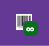
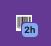
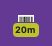
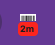
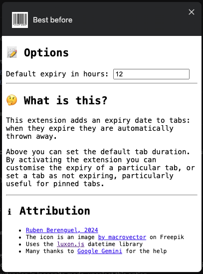
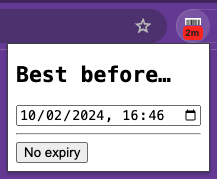
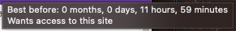

# Best before

## What is this?

This extension adds an expiry date to tabs: **when they expire they are
automatically closed**.

By activating the extension you can customise the expiry of a particular
tab, or set a tab as not expiring, particularly useful for pinned tabs.
By default, any new tab should get 12 hours, this default can be customised.

Hover over the extension to see exactly how much time a tab has left. The
extension badge shows the "topline time left", rounding up. So, it will say
"12 hours" when it's 11 hours 50 minutes. As soon as it goes below 60 minutes
it will stop rounding up and show in red, in case you need to extend it.

I take no responsibility on any data you might lose by using this extension!

---

## Caveats

The code is not great to look at, I wrote (or more like, coerced Gemini to write)
this quickly to see if I liked it.

I don't promise new releases are backward compatible. Although I will try to,
now that I use the stored data for an overview page, I may need to change it
and I assume I'm the only user.

**IMPORTANT**: expiries are not conserved after a browser restart. When Chrome restarts,
tabs will have _no_ expiry. I don't plan on fixing this, because it is hairy (would need
to depend on URL, and I don't want that). I will later add a note to the tab view page
informing of tabs that are "gone" from Chrome.

---

---

### How it looks like in Chrome (a bit outdated, it looks better now but I didn't bother creating new screenshots yet)

A tab with no expiry

A tab with less than 2 hours left, but still enough to do something about it

A tab with 20 minutes left, the amber countdown starts with 1 hour left

A tab with 2 minutes left, the red countdown starts with 15 minutes left

Options popup

Extension popup

Extension hover title

## Why?

I collect way too many tabs. I hope this will help me avoid that.

## Bugs, etc?

Sometimes pressing the quick-set buttons does not work, but I haven't found out why yet. Every time it has passed I was in the middle of something else, and on the second press it works. A small annoyance I happily pay knowing any tab I didn't really need today won't be on my computer by tomorrow morning.

Otherwise, I have used this for almost a week while improving the usage experience and I have been extremely happy with it. If you use it and find improvements I'll be happy to hear it but remember this is open source, and I created this extension _for me_ on the assumption nobody else might need it. So it should fulfill my usecases, not anybody else's. The best part though is that you can fork this repository and just install your own tweaked version manually just like this one. Freedom to tinker, freedom to change!

## Installing

- Clone or download (remember then to unzip) this repository somewhere
- In **Chrome**, _More tools > Extensions_
- In **Chrome > Extensions**, Enable developer mode
- Click _Load unpacked_, then browse to where you downloaded the repository
- Optional but recommended: pin the extension.

## What about Safari?

For Safari on Mac, the Safari extension converter ([here](https://developer.apple.com/documentation/safariservices/safari_web_extensions/converting_a_web_extension_for_safari)) from Apple will generate a usable extension, although the styling looks better in Chrome, even if I didn't do much in terms of styling. I might fix that. For Safari on iOS the extension kind of works, but not completely and the user experience is sub-par. But I'm positively surprised that it works at all without any effort. I might work on making it nicer on Safari, because I  use Chrome for work, but I use Safari on my personal devices (for battery reasons mostly). 

## Attribution

- The icon is an image [by macrovector](https://www.freepik.com/free-vector/bar-qr-codes-white-stickers-set-label-information-data-identification-strip_10602030.htm#query=barcode&position=0&from_view=keyword&track=sph&uuid=d878575d-8b03-4d9c-bc19-52617e9d7f4b) on Freepik
- Uses the [luxon.js](https://moment.github.io/luxon/#/) datetime library
- Many thanks to [Google Gemini](http://gemini.google.com") for the help.
